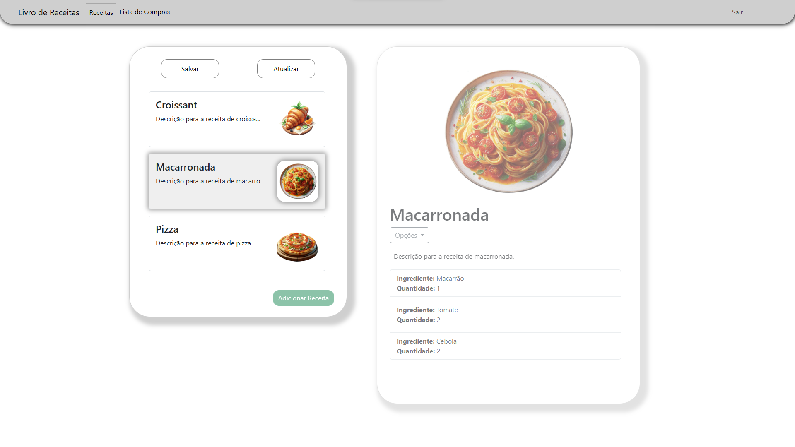
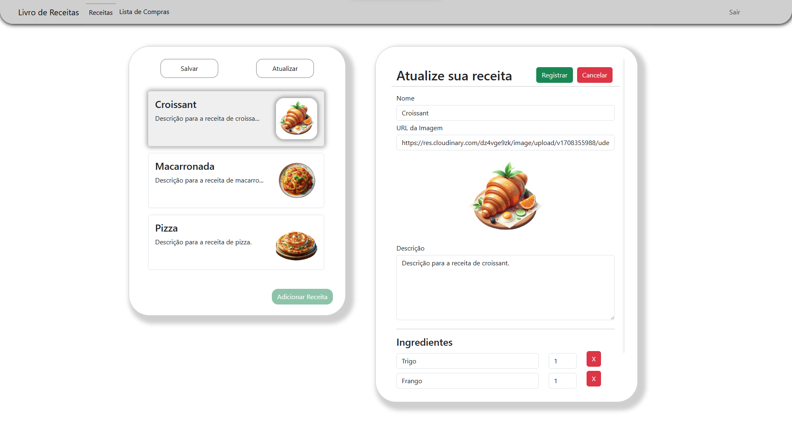
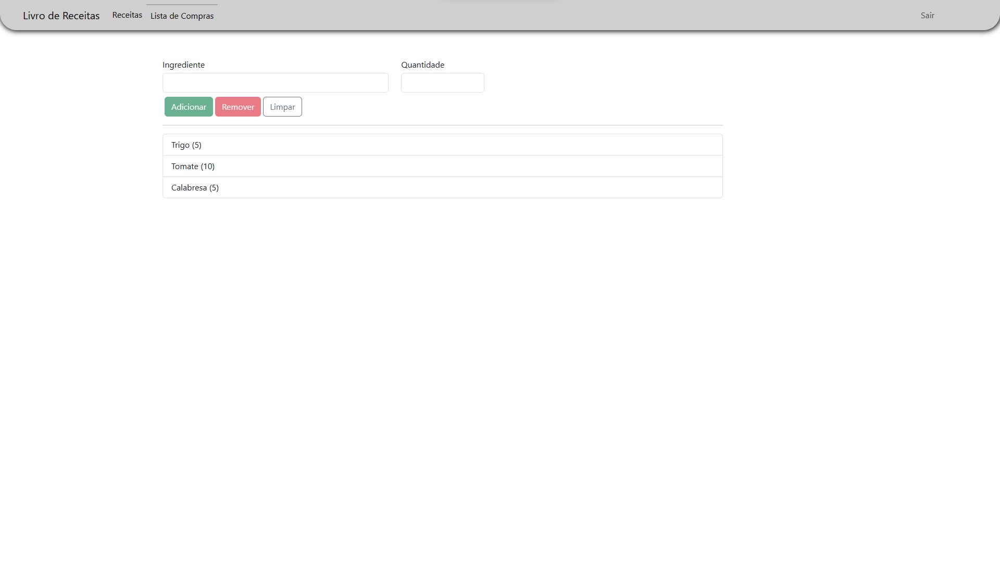
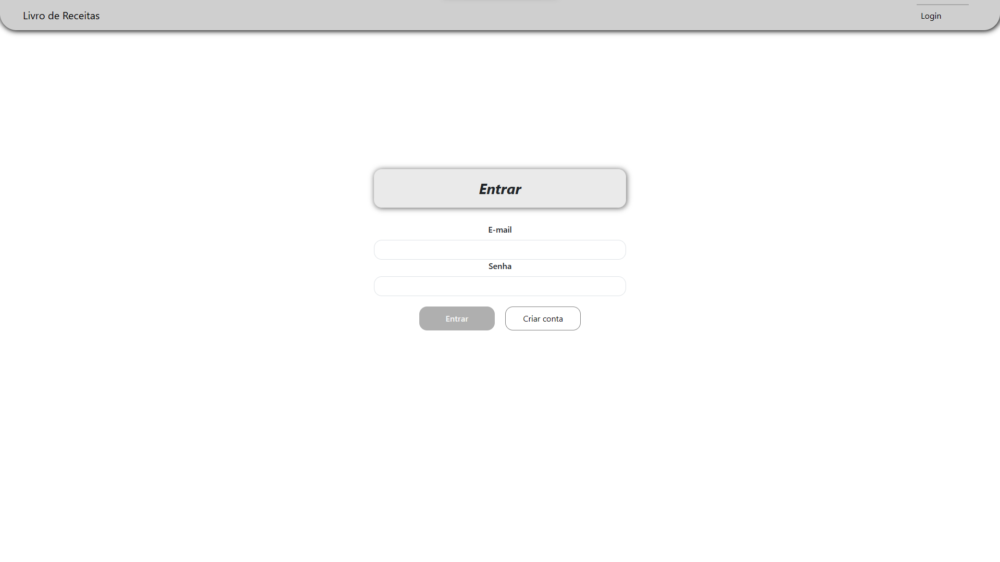

## 🍔 Registro de Receitas

Esta aplicação fornece a habilidade de registrar e fazer modificações em receitas e adicionar ingredientes para uma lista de compras. Além disso, é possível fazer o cadastro de usuários para conseguir acesso a aplicação, que utiliza o sistema de autenticação e autorização do Firebase.

## 💻 Tecnologias
<div style="display: inline_block">
    
</div>

## ⚙️ Configurações para rodar o projeto

Para fazer o sistema funcionar corretamente, é necessário adicionar um os arquivos de variáveis de ambiente do angular, com as configurações para os endpoits do Firebase.

```
ng g environments
```

Nos arquivos, adicionar as seguintes chaves e valores:

```typescript
    FIREBASE_API_KEY_SIGNUP: 'https://...com/...?key=[KEY]',
    FIREBASE_API_KEY_LOGIN: 'https://...com/...?key=[KEY]',
    STORE_RECIPE_URL: 'https://...com/recipes.json',
    FETCH_RECIPE_URL: 'https://...com/recipes.json'

```

Após essas configurações, basta apenas inicializar o projeto:

```
ng serve
```

## 📷 Imagens do projeto




